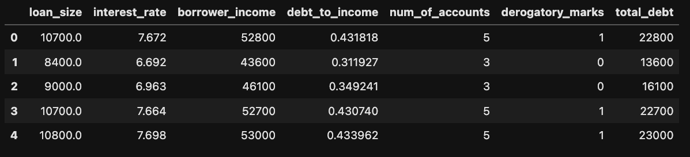
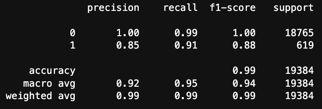
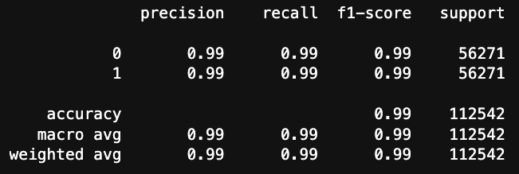

# Module_12_Challenge
## Machine Learning Models - Credit Risk

## Background
For this Challenge, I have used various techniques to train and evaluate models with imbalanced classes. I use a dataset of historical lending activity from a peer-to-peer lending services company to build a model that can identify the creditworthiness of borrowers.

Using the original dataset initially and then resampling the data by using the RandomOverSampler module from the imbalanced-learn library.

I then sum the count of the target classes, train a logistic regression classifier, calculate the balanced accuracy score, generate a confusion matrix, and generate a classification report.

## Starting the report...

After import the lending_data.csv file I review to data to confirm the uploaded data is reading into the data frame correctly.

I then create the labels set (y) from the “loan_status” column, and then create the features (X) DataFrame from the remaining columns and reviewed the X variable DataFrame.

Checking the balance of the labels variable (y) by using the value_counts function, I found a total of 75036 healthy loans and 2500 high risk loans.

I then split the data in to training and testing data sets, and fitted a logistic regression model. After reviewing the results, I evaluationed the accuracy, generated a confusion matrix and printed a classification report.

\

## Question: 
### How well does the logistic regression model predict both the 0 (healthy loan) and 1 (high-risk loan) labels?

## Answer: 
### This model predicted loans to an accuracy of 99%. This is a good model predicting with an accuracy of 100% of the healthy loans (0) and 85% of the high risk loans (1).

\
Then using the RandomOverSampler module, I balanced the healthy loans (0) and high risk loans (1) loans to be equal sets of 56271 each. After running the LogisticRegression classifier I was able to evaluate the model, check the accuracy (99.47%), print the confusion matrix and the below classification report.

\

## Question: 
### How well does the logistic regression model, fit with oversampled data, predict both the 0 (healthy loan) and 1 (high-risk loan) labels?

## Answer: 
### This model predicted a 99% accuracy for both healthy loans (0) and high risk loans (1) which is a great result for the model.